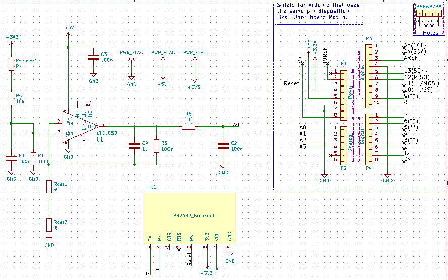
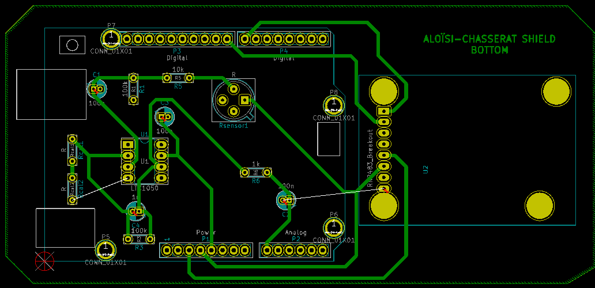
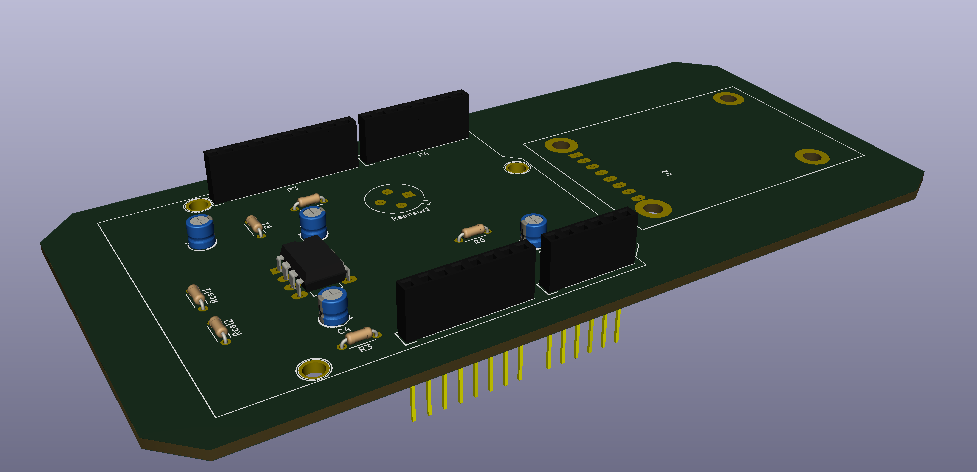
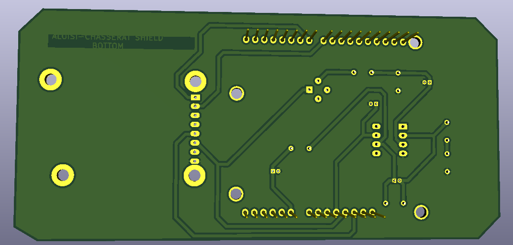

# Shield Arduino pour capteur de gaz et communication LoRa

Ce projet fut réalisé dans le cadre de l'enseignement "Microcontrolleurs et Open-Source Hardware" de la 5e année "Innovative Smart Systems" à l'INSA de Toulouse. Nous avons conçu le PCB d'un shield Arduino permettant, une fois couplé à un Arduino UNO, de collecter les valeurs issues d'un capteur de gaz, et de les partager sur le réseau TTN (The Things Network) via une puce LoRa.

 *INSA Toulouse - Aloïsi Axelle & Chasserat Laurent - Novembre 2018 - 5 IR/ISS - Groupe B2*
  
# Fonctionnalités
Fonctionnalités du shield : 

-   Branchement du capteur de gaz (qui sera réalisé en salle blanche ultérieurement)

-   Circuit d’adaptation du signal issu du capteur pour l’envoyer vers l’ADC de l’Arduino UNO, implémentant notamment :
	-    2 types de filtrage :
			-   Filtrage des bruits :
				-   Filtrage passif à l’entrée du circuit pour couper les bruits HF
				-   Filtrage actif à l’aide de l’AOP LTC1050 pour plus d’efficacité
				-   Filtrage passif en sortie du circuit pour éliminer les bruits induits par celui-ci 
			-   Filtrage anti-repliement pour permettre l’échantillonnage par l’ADC
	-   La possibilité d’adapter le calibre, par le biais d’une résistance interchangeable    
	-   Une sortie vers l’ADC de l’Arduino UNO via la broche analogique A0
	
-   Intégration d’une puce de communication LoRa RN2483, pilotable par l’Arduino UNO, afin de permettre l’envoi des information issues du capteur au réseau TTN (The Things Network).

# Contenu

Ce projet KiCad contient le code source et les fichiers de conception du shield, à savoir :

-   La partie schématique, décrivant le circuit électronique implémenté (composants, routage des pins)    
-   La partie layout, décrivant la forme de la carte, l’emplacement des différents éléments sur celle-ci et la trajectoire des pistes de routage.

# Résultat obtenu

Conception du schematic :

Conception du layout :

Rendu 3D :

# Remarques et choix de conception

- Nous avons choisi de positionner notre Software Serial sur les Pins 7 et 8 pour répliquer la fonction de la communication série sur d'autres broches numériques de la carte.
- Nous avons transformé la forme du contour du shield en un rectangle plus grand que l'Arduino UNO pour faciliter le routage et l'inclusion de la puce LoRa.
- Au niveau du PCB, des avertissements de type "Pad près d'un pad" sont soulevés au moment de la vérification, car nous avons utilisé des modèles de résistances et de capacités choisis arbitrairement parmi les composants traversants, qui se sont avérés plus petits que ceux que nous utiliserons en réalité, et donc les marges de pistes que nous avons choisis pour l'impression du PCB réel se chevauchent. Pour changer cela, il faudrait choisir d'autres empreintes pour ces composants, ou réduire la taille des pads (ce qui n'est pas possible compte tenu des contraintes de fabrication qui nous sont imposées).
- Nous avons choisi d'implémenter toute la carte sur une seule couche de cuivre pour rendre possible sa fabrication à l'INSA. Les pistes sont sur la partie Bottom qui est aussi le plan de masse et les composants sont positionnés sur la partie top.

# Pistes d'amélioration

- Il pourrait être judicieux d'implémenter un système de recharge du capteur de gaz, permettant d'y appliquer une tension entre ses broches 3 et 4 lorsqu'il est saturé. Pour ce faire, nous pourrions par exemple utiliser un transistor pliloté à l'aide d'un bouton et d'une pin de l'Arduino Uno.